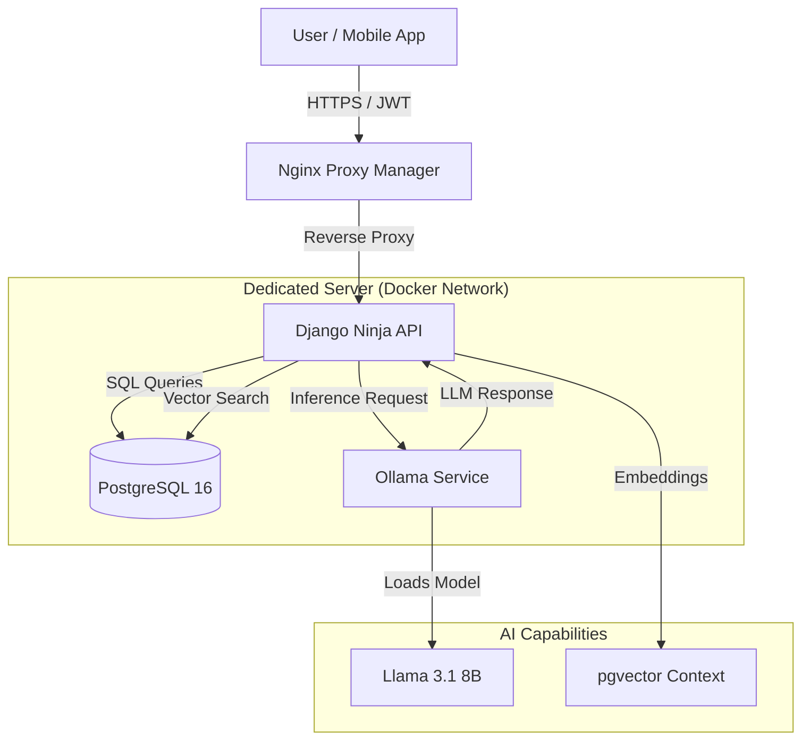
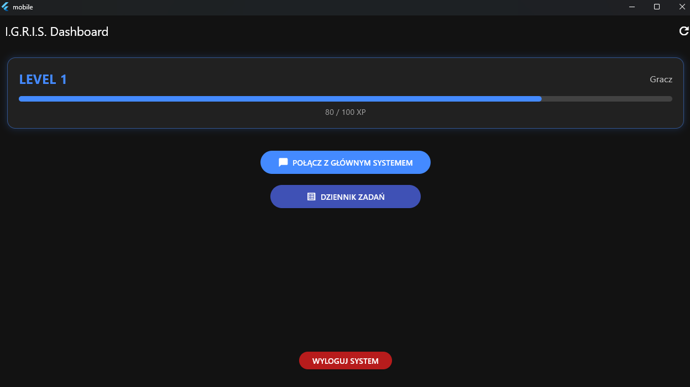
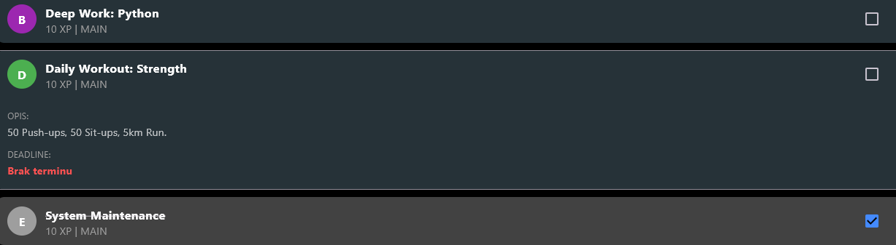

# I.G.R.I.S. (Intelligent Guidance & Resource Integration System)

[-success)](https://github.com/YOUR_USERNAME/IGRIS-Showcase)

> **"Wakey wakey."**

## ⚠️ Disclaimer
**This repository serves as a technical showcase and documentation.**
The source code for **I.G.R.I.S.** is currently **private (Closed Source)** due to planned commercialization and proprietary algorithms. This repository demonstrates the architecture, technology stack, and features implemented during the development process.

---

## 📖 Project Overview
**I.G.R.I.S.** is an advanced Personal OS (Operating System for Life) that bridges the gap between **Gamification** and **AI Assistance**.

Inspired by the "System" from *Solo Leveling* and J.A.R.V.I.S. from *Iron Man*, the application functions as a gamified layer over reality. It tracks user progress (XP, Levels, Stats), manages tasks via AI analysis, and utilizes Long-Term Memory (RAG) to provide context-aware guidance.

Unlike standard wrappers for ChatGPT, I.G.R.I.S. runs entirely **Self-Hosted** on dedicated hardware, ensuring complete data privacy and zero dependency on external cloud providers.

## 🛠️ Tech Stack & Infrastructure

### Core Infrastructure

### Backend (The Brain)

-092E20?logo=django&logoColor=white)

### Artificial Intelligence

-0467DF)
-FF5722)

### Mobile Frontend (The Interface)

---

## 🏗️ System Architecture

The system operates on a Microservices-lite architecture tailored for a dedicated server environment.

## ✨ Key Features

### 1. The "Solo Leveling" Gamification Engine
* **Real RPG Stats:** System tracks Strength, Intelligence, Vitality, and Sense.
* **XP Algorithm:** Custom math logic (exponential curve) handles leveling up – avoiding AI hallucinations for numerical data.
* **Quest System:** Supports Daily, Weekly, and Recurring quests with automated resets.

### 2. Private AI Brain (Self-Hosted)
* **No Cloud Dependency:** Runs locally on an Intel i5-12500 using Dockerized Ollama.
* **Context Aware:** Uses **RAG (Retrieval-Augmented Generation)**. The AI remembers past conversations, user preferences, and biographical data by querying the vector database before answering.
* **Context Injection:** The system automatically injects the user's current Level, Stats, and unfinished quests into the AI prompt, making the assistant aware of the user's "status".

### 3. Secure & Scalable
* **Hybrid Storage:** Critical data in PostgreSQL, local caches in SQLite (Mobile).
* **Security:** Full JWT Authentication with Refresh Token rotation.
* **Networking:** Services run in an isolated Docker Network; only the API Gateway is exposed via Nginx.

---

## 🗺️ Project Roadmap

### Phase 1: Foundation (Completed) ✅
- [x] **Infrastructure:** Server migration to Intel i5-12500 (Alder Lake).
- [x] **DevOps:** Full Dockerization of Backend, DB, and AI services.
- [x] **Backend:** Django Ninja API implementation with Async support.
- [x] **AI Core:** Migration from `llama.cpp` legacy build to Dockerized Ollama (Llama 3.1).
- [x] **Memory:** Implementation of `pgvector` for semantic search/long-term memory.
- [x] **Mobile:** Functional Flutter App (Login, Chat, Quest List, Stats Dashboard).

### Phase 2: Expansion (In Progress) 🚧
- [ ] **Computer Vision:** Real-time exercise form analysis via camera.
- [ ] **IoT Integration:** Syncing heart rate and sleep data (Garmin/Apple Watch).
- [ ] **Voice Module:** Wake-word activation and TTS (Text-to-Speech) for hands-free mode.
- [ ] **SaaS Architecture:** Preparing multi-tenancy for commercial release.
- [ ] **Smart Shopping:** AI analyzing receipts (OCR) and optimizing grocery expenses based on diet.

---

## 📸 Gallery & Showcase

### 1. The Dashboard (Player Stats)
*Visualizes the RPG layer: XP Bar, Level, and Attributes.*

### 2. Context-Aware Chat
*Demonstrates RAG capabilities – AI remembers context from previous sessions.*

### 3. Quest Log
*Task management interface with Daily/Weekly assignments.*

---

## 📬 Contact
Created by **[Your Name]**.
*Open to opportunities in Backend (Python/Django) & Full-Stack Development.*
